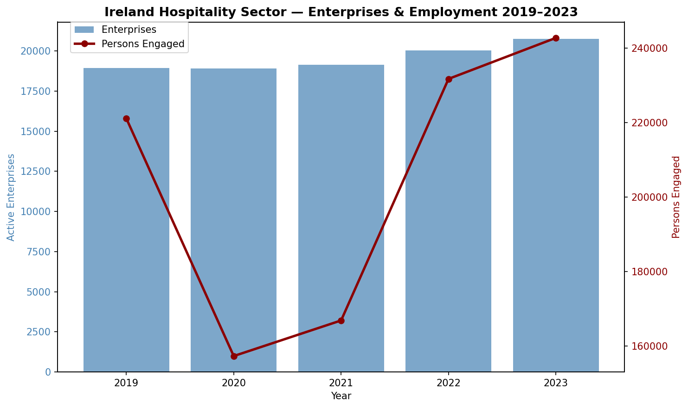
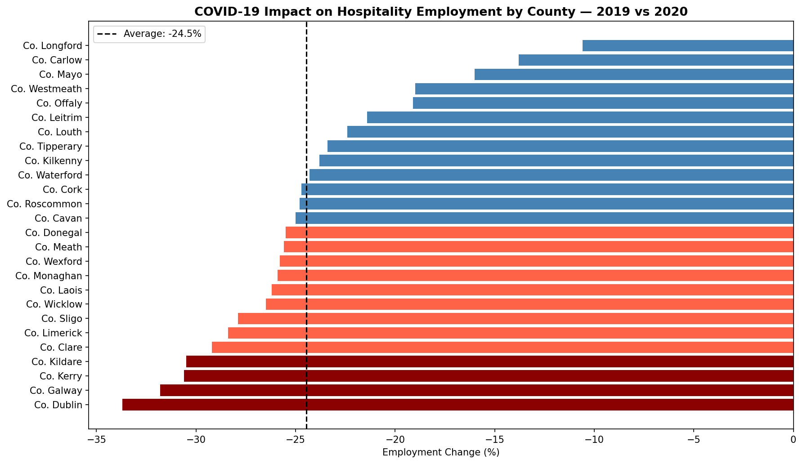
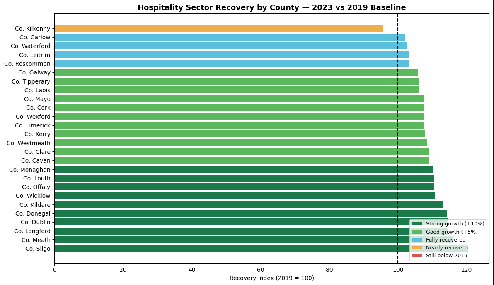
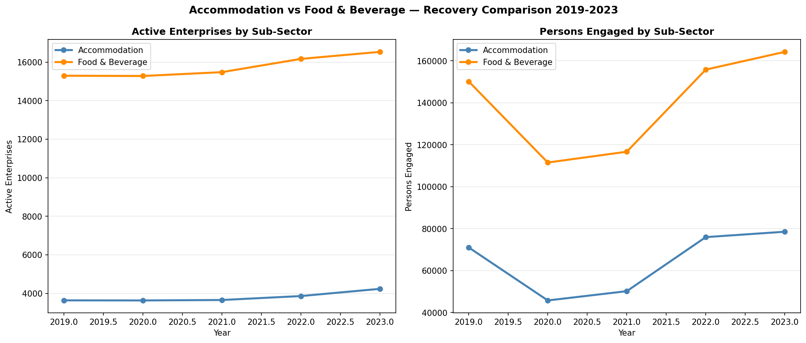
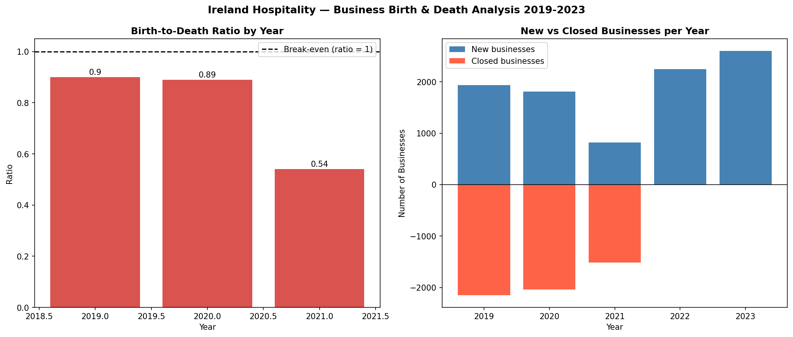

# 🏨 Ireland Hospitality Sector — SQL & Python Analysis

> **Analysing the impact of COVID-19, recovery trends, and employment shifts across Ireland's hospitality industry (2019–2023) using official government data.**


---

## 📌 Project Overview

Ireland's hospitality sector — hotels, restaurants, bars, and food service businesses — was one of the most severely impacted industries during the COVID-19 pandemic. This project uses **official data from the Central Statistics Office (CSO) Ireland** to analyse:

- How many hospitality businesses were active across all 26 Irish counties from 2019 to 2023
- The scale of job losses during COVID-19 and which counties were hit hardest
- How quickly the sector recovered after restrictions were lifted
- The difference in recovery speed between Accommodation and Food & Beverage sub-sectors
- Whether more businesses were opening or closing each year (birth-to-death ratio)

---

## 🔑 Key Findings

### The COVID-19 Crash
- In 2020, Ireland's hospitality sector lost **63,868 jobs in a single year** — a drop of **28.9%**
- **Co. Dublin** was hardest hit with a **-33.7%** employment drop, followed by Co. Galway (-31.8%) and Co. Kerry (-30.6%)
- Every single county in Ireland recorded a decline in hospitality employment in 2020

### The Recovery
- By 2022 the sector had **fully surpassed pre-pandemic levels**
- By 2023 the sector reached a **new historic high of 242,791 persons engaged** — up 9.8% vs 2019
- **Co. Longford** recorded the strongest recovery (+43.6%), followed by Co. Kildare (+37.5%) and Co. Offaly (+36.7%)

### Business Health
- The sector was already contracting **before COVID** — in 2019 more businesses closed than opened (ratio: 0.90)
- 2021 was the worst year on record: only **821 new businesses opened** against **1,513 closures** (ratio: 0.54)
- Micro businesses (under 10 employees) represented over **90% of all closures** every year

### Sub-Sector Comparison
- Accommodation was hit harder in 2020 — hotels were fully closed during lockdowns
- Food & Beverage showed more resilience due to takeaway and delivery operations
- By 2023 both sub-sectors surpassed 2019 enterprise and employment levels

---

## 📊 Charts

### Chart 1 — National Overview: Enterprises & Employment 2019–2023


### Chart 2 — COVID-19 Impact by County


### Chart 3 — Recovery Index by County (2023 vs 2019)


### Chart 4 — Accommodation vs Food & Beverage


### Chart 5 — Business Birth-to-Death Ratio


---

## 🗃️ Data Sources

All data used in this project is **publicly available and officially published** by the Irish government:

| Dataset | Source | Description | Years |
|---------|--------|-------------|-------|
| BRA34 | [CSO Ireland](https://data.cso.ie/table/BRA34) | Active enterprises by activity and county | 2019–2023 |
| BRA31 | [CSO Ireland](https://data.cso.ie/table/BRA31) | Enterprise births by activity and employment size | 2019–2023 |
| BRA35 | [CSO Ireland](https://data.cso.ie/table/BRA35) | Enterprise deaths by activity and employment size | 2017–2022 |

---

## 📁 Repository Structure

```
ireland-hospitality-sql-analysis/
│
├── data/
│   └── raw/                          ← CSO Ireland CSV files
│
├── sql/
│   ├── 01_create_tables.sql          ← database schema
│   └── 02_analysis.sql               ← SQL analysis queries
│
├── notebooks/
│   └── ireland_hospitality_analysis.ipynb  ← full analysis with charts
│
├── images/
│   └── screenshots/                  ← all 5 charts as PNG
│
└── README.md
```

---

## 🛠️ Tools & Technologies

- **PostgreSQL** — relational database for storing and querying CSO data
- **Python** — data analysis and visualisation
- **Pandas** — data manipulation and SQL query results
- **Matplotlib** — chart creation
- **Jupyter Notebook** — interactive analysis environment
- **SQLAlchemy** — database connection
- **Git / GitHub** — version control and portfolio hosting

---

## ▶️ How to Run

1. Clone the repository:
```bash
git clone https://github.com/CleitoSilva/ireland-hospitality-sql-analysis.git
```

2. Set up PostgreSQL and run the schema:
```bash
psql -U postgres -d postgres -f sql/01_create_tables.sql
```

3. Load the CSO CSV files into the database (see `sql/01_create_tables.sql` for instructions)

4. Open the Jupyter Notebook:
```bash
jupyter notebook notebooks/ireland_hospitality_analysis.ipynb
```

5. Run all cells: **Kernel → Restart & Run All**

---

## 💡 SQL Skills Demonstrated

- Database schema design
- Data cleaning and staging tables
- `JOIN` across multiple datasets
- Common Table Expressions (CTEs)
- Window Functions (`LAG`, `FIRST_VALUE`, `RANK`)
- Aggregations and derived metrics
- Year-over-year analysis

---

## 👤 Author

**Cleiton Silva** — Junior Data Analyst based in Ireland

- GitHub: [@CleitoSilva](https://github.com/CleitoSilva)
- Open to Junior Data Analyst opportunities in Ireland 🇮🇪

---

## 📄 License

This project is open source under the [MIT License](LICENSE).

Data sourced from CSO Ireland is available under the [PSI General Licence](https://www.gov.ie/en/circular/2-2012-psi-general-licence/).
